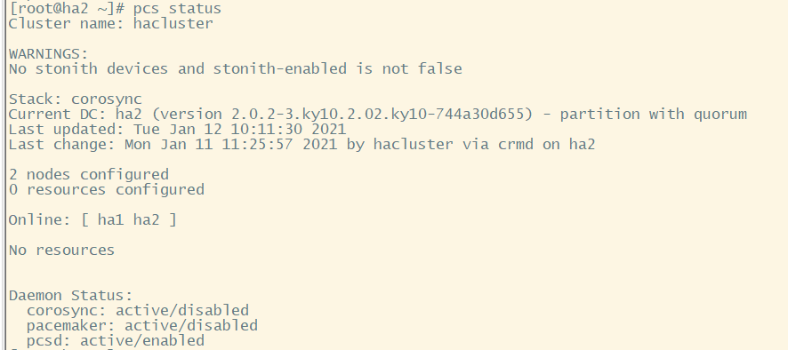

# HA Installation

see [README](../README.en.md#Installation)


## Environment Requirement
 - at least 2 machines with openEuler 20.03 LTS-SP1 installed

## Steps

***note：all the machines need to operate, exampled by ha1***

### modify hostname and `/etc/hosts`
before use HA software, you need to make sure the hostname has been modified and record all hostname in `/etc/hosts`.

```
[root@ha1 ~]# hostnamectl set-hostname ha1
[root@ha1 ~]# vim /etc/hosts
10.1.80.20 ha1
10.1.80.21 ha2
```

### turn off firewall

```
[root@ha1 ~]# systemctl stop firewalld
```

modify SELINUX config to disabled:
```
[root@ha1 ~]# vim /etc/selinux/config
SELINUX=disabled
SELINUXTYPE=targeted
```

### install HA software

The yum repositories is well configed by default after the OS is install, but you still need to check it. The file is `/etc/yum.repos.d/openEuler.repo` and the following repositories will be used:

```
[OS]
name=OS
baseurl=http://repo.openeuler.org/openEuler-20.03-LTS-SP1/OS/$basearch/
enabled=1
gpgcheck=1
gpgkey=http://repo.openeuler.org/openEuler-20.03-LTS-SP1/OS/$basearch/RPM-GPG-KEY-openEuler

[everything]
name=everything
baseurl=http://repo.openeuler.org/openEuler-20.03-LTS-SP1/everything/$basearch/
enabled=1
gpgcheck=1
gpgkey=http://repo.openeuler.org/openEuler-20.03-LTS-SP1/everything/$basearch/RPM-GPG-KEY-openEuler

[EPOL]
name=EPOL
baseurl=http://repo.openeuler.org/openEuler-20.03-LTS-SP1/EPOL/$basearch/
enabled=1
gpgcheck=1
gpgkey=http://repo.openeuler.org/openEuler-20.03-LTS-SP1/OS/$basearch/RPM-GPG-KEY-openEuler
```

Install the following HA packages:

```
[root@ha1~]# yum install corosync pacemaker pcs fence-agents fence-virt corosync-qdevice sbd drbd drbd-utils
```

### set hacluster user password

```
[root@ha1~]# passwd hacluster
```

### modify `/etc/corosync/corosync.conf`

```
totem {
        version: 2
        cluster_name: hacluster
         crypto_cipher: none
        crypto_hash: none
}
logging {         
        fileline: off
        to_stderr: yes
        to_logfile: yes
        logfile: /var/log/cluster/corosync.log
        to_syslog: yes
        debug: on
       logger_subsys {
               subsys: QUORUM
               debug: on
        }
}
quorum {
           provider: corosync_votequorum
           expected_votes: 2
           two_node: 1
       }
nodelist {
       node {
               name: ha1
               nodeid: 1
               ring0_addr: 10.1.80.21
               }
        node {
               name: ha2
               nodeid: 2
               ring0_addr: 10.1.80.22
               }
        }
```

### start services

Start the following services:

```
[root@ha1~]# systemctl start pcsd
[root@ha1~]# systemctl start pacemaker
[root@ha1~]# systemctl start corosync
```

### authenticate the nodes

***note: only needed to run on one node***

```
[root@ha1~]# pcs host auth ha1 ha2
```

### check HA cluster status

Check HA cluster status by command `pcs status`.
```
[root@ha1~]# pcs status
```


